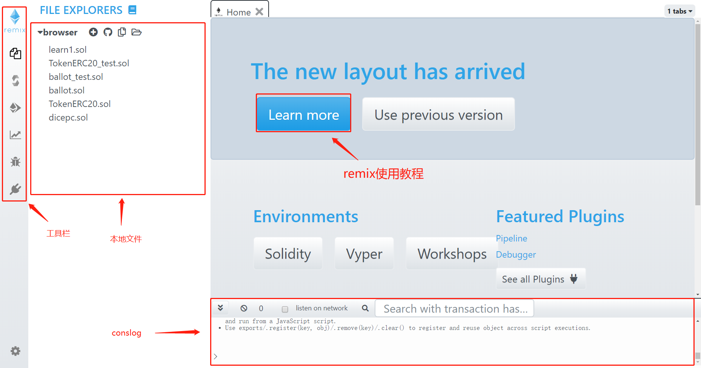
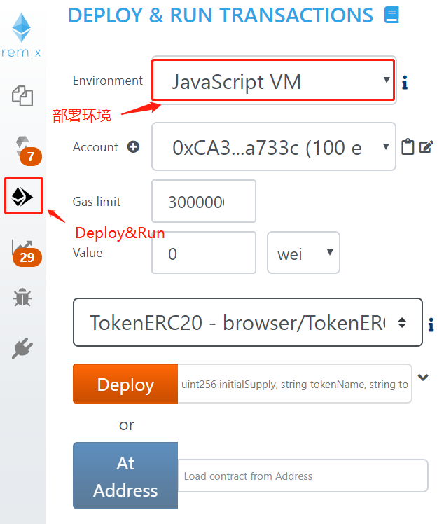
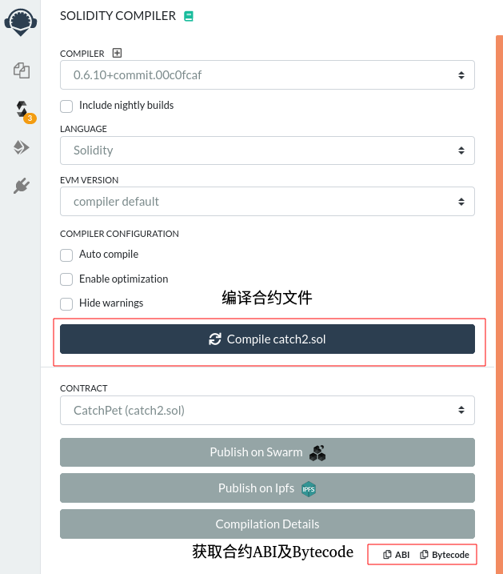

# 合约开发

## 1. Remix 的基本使用

BVM虚拟机支持solidity语言且兼容EVM虚拟机，建议开发者使用[Remix IDE](https://remix.ethereum.org/)进行智能合约的开发调试。进入Remix首页后，您将看到下图页面，可以点击`Learn more`学习使用Remix。




合约编写完成后，在进行模拟部署时，建议选择`JavaScript VM`环境。




## 2.  获取合约ABI及Byte_code




# 合约部署调用

## 1. 合约示例

- 合约CatchPet.solidity源码如下：

```shell
pragma solidity >=0.5.11;

//import "github.com/oraclize/ethereum-api/oraclizeAPI.sol";
//import "github.com/Arachnid/solidity-stringutils/strings.sol";
pragma experimental ABIEncoderV2;

contract CatchPet {
    
    struct Pet {
        string  Type;
        uint    Point;
        uint    Repertory;
    }
    
    struct PetMsg {
        uint    PetID;
        string  Type;
        string  Name;
        uint    Point;
        bool    IsSaled;
    }
    
    struct CatchRecord {
        string  Type;
        uint    Height;
        uint    Time;
    }
    
    struct SaleRecord {
        string  Type;
        uint    Height;
        uint    Point;
        uint    Time;
    }
    
    mapping(string => Pet) pets;
    mapping(address => PetMsg[]) petMsges;
    mapping(address => uint) pID;
    mapping(address => uint) point;
    mapping(address => CatchRecord[]) catchRecord;
    mapping(address => SaleRecord[]) saleRecord;
    
    // game 参数
    uint constant SEEDINFO = 0x0000000000002000000000100000000008000000000400000000020000000001;
    
    constructor () public {
        // pets warehouse init
        pets["dog"].Type = "dog";
        pets["dog"].Point = 40;
        pets["dog"].Repertory = 10;
        
        pets["cat"].Type = "cat";
        pets["cat"].Point = 20;
        pets["cat"].Repertory = 20;
        
        pets["monkey"].Type = "monkey";
        pets["monkey"].Point = 100;
        pets["monkey"].Repertory = 4;
        
        pets["panda"].Type = "panda";
        pets["panda"].Point = 200;
        pets["panda"].Repertory = 2;
        
    }
    
    function GetPetRepertory(string memory _petType) public view returns(Pet memory){
        Pet memory pet = pets[_petType];
        return pet;
    }
    
    function Catch() external payable returns(string memory) {
        require(msg.value >= 50000000000, "transfer value must great than 50000000000");
        
        uint blockNumber = block.number;
        bytes32 entropy = keccak256(abi.encodePacked(uint(SEEDINFO),blockhash(blockNumber)));

        uint petSite = uint(entropy) % 36; 
        string memory petType = getPetType(petSite);
        
        PetMsg memory _newPet;
        _newPet.Name = "";
        _newPet.Type = petType;
        _newPet.PetID = pID[msg.sender];
        _newPet.Point = pets[petType].Point;
        petMsges[msg.sender].push(_newPet);
        _newPet.IsSaled = false;
        pID[msg.sender] += 1;
        
        CatchRecord memory _cRecord;
        _cRecord.Type = petType;
        _cRecord.Height = blockNumber;
        _cRecord.Time = now;
        catchRecord[msg.sender].push(_cRecord);
        
        return petType;
    }
    
    function GetPlayerPets() public view returns(PetMsg[] memory) {
        return petMsges[msg.sender];
    }
    
    function GetCatchRecord() public view returns(CatchRecord[] memory) {
        return catchRecord[msg.sender];
    }
    
    function Sale(uint _petID) public {

        uint index;
        bool ifExit;
        (index, ifExit) = getPetByID(_petID);
        if (ifExit) {
            point[msg.sender] +=petMsges[msg.sender][index].Point;
            
            SaleRecord memory sr;
            sr.Type = petMsges[msg.sender][index].Type;
            sr.Height = block.number;
            sr.Point = petMsges[msg.sender][index].Point;
            sr.Time = now;
            
            saleRecord[msg.sender].push(sr);
            petMsges[msg.sender][index].IsSaled = true;
        }
    }
    
    function GetSaleRecord() public view returns(SaleRecord[] memory) {
        return saleRecord[msg.sender];
    }
    
    function ChangePetName(string memory _name, uint _id) public {
        uint index;
        bool ifExit;
        (index, ifExit) = getPetByID(_id);
        if (ifExit) {
            petMsges[msg.sender][index].Name = _name;
        }
        
    }
    
    function GetPlayerPoint() public view returns(uint) {
        return point[msg.sender];
    }
    
    function getPetByID(uint _petID) internal returns(uint, bool) {
        PetMsg[] storage petStore = petMsges[msg.sender];
        for (uint i = 0; i < petStore.length; i++) {
            if ((petStore[i].PetID == _petID) && !petStore[i].IsSaled) {
                return (i, true);
            }
        }
        
        return (0, false);
    }
    
    function getPetType(uint _peyID) internal returns(string memory) {
        if (_peyID >= 0 && _peyID < 20) {
            return "cat";
        } else if (_peyID >= 20 && _peyID < 30) {
            return "dog";
        } else if (_peyID >= 30 && _peyID < 34) {
            return "monkey";
        } else if (_peyID >= 34 && _peyID < 36) {
            return "panda";
        } else {
            return "";
        }
    }
    
   }
```


## 2. BCC工具配置

- 主链配置：根据ChainID不同，修改bcc.yaml文件的defaultChainID字段，同时修改或添加对应的IP地址
- 示例：ChainID = “devtest”

```shell
# 默认配置
defaultChainID: "devtest"

# 区块链知名入口
urls: !!map
  bcb:
    - "https://earth.bcbchain.io"
    - "https://mars.bcbchain.io"
    - "https://venus.bcbchain.io"
    - "https://mercury.bcbchain.io"
    - "https://jupiter.bcbchain.io"
    - "https://saturn.bcbchain.io"

  bcbtest:
    - "https://tearth.bcbchain.io"
    - "https://tmars.bcbchain.io"
    - "https://tvenus.bcbchain.io"
    - "https://tmercury.bcbchain.io"
    - "https://tjupiter.bcbchain.io"
    - "https://tsaturn.bcbchain.io"

  local:
    - "http://localhost:46657"

  devtest:
    - "http://192.168.254.162:46657"
    - "http://192.168.254.163:46657"
    - "http://192.168.254.164:46657"
    - "http://192.168.254.161:46657"
```


## 3. 合约编译

- 使用BCCToolBox工具或Remix编辑器进行合约编译

- 通过BCCToolBox工具编译

```shell
# 编译指令 
# PS：-f为源码文件的路径
# PS：-a为绑定代币的代币地址
./bcc solDeploy -f ./CatchPet.solidity -a bcbtJ4zVVdGeVNNhBNYRNzoYAvDyyZdtwcDXS -n owner -p Ab1@Cd3$ -g 10000000 
```

- 通过Remix编辑器编译

- 详情请参照同级目录下的合约开发文档

  
  
- 合约编译生成的二进制文件CatchPet.bin的内容如下：

```shell
60806040523480156200001157600080fd5b506040518060400160405280600381526020017f646f67000000000000000000000000000000000000000000000000000000000081525060006040516200005890620004d2565b908152602001604051809103902060000190805190602001906200007e92919062000304565b50602860006040516200009190620004d2565b908152602001604051809103902060010181905550600a6000604051620000b890620004d2565b9081526020016040518091039020600201819055506040518060400160405280600381526020017f636174000000000000000000000000000000000000000000000000000000000081525060006040516200011390620004e9565b908152602001604051809103902060000190805190602001906200013992919062000304565b50601460006040516200014c90620004e9565b908152602001604051809103902060010181905550601460006040516200017390620004e9565b9081526020016040518091039020600201819055506040518060400160405280600681526020017f6d6f6e6b657900000000000000000000000000000000000000000000000000008152506000604051620001ce9062000500565b90815260200160405180910390206000019080519060200190620001f492919062000304565b5060646000604051620002079062000500565b908152602001604051809103902060010181905550600460006040516200022e9062000500565b9081526020016040518091039020600201819055506040518060400160405280600581526020017f70616e646100000000000000000000000000000000000000000000000000000081525060006040516200028990620004bb565b90815260200160405180910390206000019080519060200190620002af92919062000304565b5060c86000604051620002c290620004bb565b90815260200160405180910390206001018190555060026000604051620002e990620004bb565b90815260200160405180910390206002018190555062000522565b828054600181600116156101000203166002900490600052602060002090601f016020900481019282601f106200034757805160ff191683800117855562000378565b8280016001018555821562000378579182015b82811115620003775782518255916020019190600101906200035a565b5b5090506200038791906200038b565b5090565b620003b091905b80821115620003ac57600081600090555060010162000392565b5090565b90565b6000620003c260058362000517565b91507f70616e64610000000000000000000000000000000000000000000000000000006000830152600582019050919050565b60006200040460038362000517565b91507f646f6700000000000000000000000000000000000000000000000000000000006000830152600382019050919050565b60006200044660038362000517565b91507f63617400000000000000000000000000000000000000000000000000000000006000830152600382019050919050565b60006200048860068362000517565b91507f6d6f6e6b657900000000000000000000000000000000000000000000000000006000830152600682019050919050565b6000620004c882620003b3565b9150819050919050565b6000620004df82620003f5565b9150819050919050565b6000620004f68262000437565b9150819050919050565b60006200050d8262000479565b9150819050919050565b600081905092915050565b611b8180620005326000396000f3fe60806040526004361061007b5760003560e01c80636d7b53911161004e5780636d7b539114610131578063c0a8d68d1461015c578063f501cd9214610185578063fdfc0941146101ae5761007b565b806301529cf0146100805780633989ca97146100bd578063414aa080146100db57806347378eec14610106575b600080fd5b34801561008c57600080fd5b506100a760048036038101906100a2919061130c565b6101d9565b6040516100b49190611934565b60405180910390f35b6100c56102d3565b6040516100d291906118f2565b60405180910390f35b3480156100e757600080fd5b506100f061062b565b6040516100fd9190611956565b60405180910390f35b34801561011257600080fd5b5061011b610672565b604051610128919061188c565b60405180910390f35b34801561013d57600080fd5b506101466107c4565b60405161015391906118ae565b60405180910390f35b34801561016857600080fd5b50610183600480360381019061017e91906113a1565b6109d3565b005b34801561019157600080fd5b506101ac60048036038101906101a7919061134d565b610d32565b005b3480156101ba57600080fd5b506101c3610dc3565b6040516101d091906118d0565b60405180910390f35b6101e1611163565b6101e9611163565b6000836040516101f99190611849565b9081526020016040518091039020604051806060016040529081600082018054600181600116156101000203166002900480601f0160208091040260200160405190810160405280929190818152602001828054600181600116156101000203166002900480156102ab5780601f10610280576101008083540402835291602001916102ab565b820191906000526020600020905b81548152906001019060200180831161028e57829003601f168201915b5050505050815260200160018201548152602001600282015481525050905080915050919050565b6060640ba43b740034101561031d576040517f08c379a000000000000000000000000000000000000000000000000000000000815260040161031490611914565b60405180910390fd5b600043905060007920000000001000000000080000000004000000000200000000018240604051602001610352929190611860565b604051602081830303815290604052805190602001209050600060248260001c8161037957fe5b069050606061038782610f1f565b9050610391611184565b604051806020016040528060008152508160400181905250818160200181905250600260003373ffffffffffffffffffffffffffffffffffffffff1673ffffffffffffffffffffffffffffffffffffffff1681526020019081526020016000205481600001818152505060008260405161040b9190611849565b908152602001604051809103902060010154816060018181525050600160003373ffffffffffffffffffffffffffffffffffffffff1673ffffffffffffffffffffffffffffffffffffffff1681526020019081526020016000208190806001815401808255809150506001900390600052602060002090600502016000909190919091506000820151816000015560208201518160010190805190602001906104b59291906111b5565b5060408201518160020190805190602001906104d29291906111b5565b506060820151816003015560808201518160040160006101000a81548160ff021916908315150217905550505060008160800190151590811515815250506001600260003373ffffffffffffffffffffffffffffffffffffffff1673ffffffffffffffffffffffffffffffffffffffff16815260200190815260200160002060008282540192505081905550610566611235565b8281600001819052508581602001818152505042816040018181525050600460003373ffffffffffffffffffffffffffffffffffffffff1673ffffffffffffffffffffffffffffffffffffffff16815260200190815260200160002081908060018154018082558091505060019003906000526020600020906003020160009091909190915060008201518160000190805190602001906106089291906111b5565b506020820151816001015560408201518160020155505082965050505050505090565b6000600360003373ffffffffffffffffffffffffffffffffffffffff1673ffffffffffffffffffffffffffffffffffffffff16815260200190815260200160002054905090565b6060600460003373ffffffffffffffffffffffffffffffffffffffff1673ffffffffffffffffffffffffffffffffffffffff168152602001908152602001600020805480602002602001604051908101604052809291908181526020016000905b828210156107bb5783829060005260206000209060030201604051806060016040529081600082018054600181600116156101000203166002900480601f01602080910402602001604051908101604052809291908181526020018280546001816001161561010002031660029004801561078f5780601f106107645761010080835404028352916020019161078f565b820191906000526020600020905b81548152906001019060200180831161077257829003601f168201915b5050505050815260200160018201548152602001600282015481525050815260200190600101906106d3565b50505050905090565b6060600160003373ffffffffffffffffffffffffffffffffffffffff1673ffffffffffffffffffffffffffffffffffffffff168152602001908152602001600020805480602002602001604051908101604052809291908181526020016000905b828210156109ca57838290600052602060002090600502016040518060a001604052908160008201548152602001600182018054600181600116156101000203166002900480601f0160208091040260200160405190810160405280929190818152602001828054600181600116156101000203166002900480156108eb5780601f106108c0576101008083540402835291602001916108eb565b820191906000526020600020905b8154815290600101906020018083116108ce57829003601f168201915b50505050508152602001600282018054600181600116156101000203166002900480601f01602080910402602001604051908101604052809291908181526020018280546001816001161561010002031660029004801561098d5780601f106109625761010080835404028352916020019161098d565b820191906000526020600020905b81548152906001019060200180831161097057829003601f168201915b50505050508152602001600382015481526020016004820160009054906101000a900460ff16151515158152505081526020019060010190610825565b50505050905090565b6000806109df83611085565b80925081935050508015610d2d57600160003373ffffffffffffffffffffffffffffffffffffffff1673ffffffffffffffffffffffffffffffffffffffff1681526020019081526020016000208281548110610a3757fe5b906000526020600020906005020160030154600360003373ffffffffffffffffffffffffffffffffffffffff1673ffffffffffffffffffffffffffffffffffffffff16815260200190815260200160002060008282540192505081905550610a9d611256565b600160003373ffffffffffffffffffffffffffffffffffffffff1673ffffffffffffffffffffffffffffffffffffffff1681526020019081526020016000208381548110610ae757fe5b90600052602060002090600502016001018054600181600116156101000203166002900480601f016020809104026020016040519081016040528092919081815260200182805460018160011615610100020316600290048015610b8c5780601f10610b6157610100808354040283529160200191610b8c565b820191906000526020600020905b815481529060010190602001808311610b6f57829003601f168201915b5050505050816000018190525043816020018181525050600160003373ffffffffffffffffffffffffffffffffffffffff1673ffffffffffffffffffffffffffffffffffffffff1681526020019081526020016000208381548110610bed57fe5b90600052602060002090600502016003015481604001818152505042816060018181525050600560003373ffffffffffffffffffffffffffffffffffffffff1673ffffffffffffffffffffffffffffffffffffffff1681526020019081526020016000208190806001815401808255809150506001900390600052602060002090600402016000909190919091506000820151816000019080519060200190610c979291906111b5565b50602082015181600101556040820151816002015560608201518160030155505060018060003373ffffffffffffffffffffffffffffffffffffffff1673ffffffffffffffffffffffffffffffffffffffff1681526020019081526020016000208481548110610d0357fe5b906000526020600020906005020160040160006101000a81548160ff021916908315150217905550505b505050565b600080610d3e83611085565b80925081935050508015610dbd5783600160003373ffffffffffffffffffffffffffffffffffffffff1673ffffffffffffffffffffffffffffffffffffffff1681526020019081526020016000208381548110610d9757fe5b90600052602060002090600502016002019080519060200190610dbb9291906111b5565b505b50505050565b6060600560003373ffffffffffffffffffffffffffffffffffffffff1673ffffffffffffffffffffffffffffffffffffffff168152602001908152602001600020805480602002602001604051908101604052809291908181526020016000905b82821015610f165783829060005260206000209060040201604051806080016040529081600082018054600181600116156101000203166002900480601f016020809104026020016040519081016040528092919081815260200182805460018160011615610100020316600290048015610ee05780601f10610eb557610100808354040283529160200191610ee0565b820191906000526020600020905b815481529060010190602001808311610ec357829003601f168201915b50505050508152602001600182015481526020016002820154815260200160038201548152505081526020019060010190610e24565b50505050905090565b606060008210158015610f325750601482105b15610f74576040518060400160405280600381526020017f63617400000000000000000000000000000000000000000000000000000000008152509050611080565b60148210158015610f855750601e82105b15610fc7576040518060400160405280600381526020017f646f6700000000000000000000000000000000000000000000000000000000008152509050611080565b601e8210158015610fd85750602282105b1561101a576040518060400160405280600681526020017f6d6f6e6b657900000000000000000000000000000000000000000000000000008152509050611080565b6022821015801561102b5750602482105b1561106d576040518060400160405280600581526020017f70616e64610000000000000000000000000000000000000000000000000000008152509050611080565b6040518060200160405280600081525090505b919050565b6000806000600160003373ffffffffffffffffffffffffffffffffffffffff1673ffffffffffffffffffffffffffffffffffffffff168152602001908152602001600020905060008090505b818054905081101561115157848282815481106110ea57fe5b906000526020600020906005020160000154148015611131575081818154811061111057fe5b906000526020600020906005020160040160009054906101000a900460ff16155b156111445780600193509350505061115e565b80806001019150506110d1565b5060008081915092509250505b915091565b60405180606001604052806060815260200160008152602001600081525090565b6040518060a00160405280600081526020016060815260200160608152602001600081526020016000151581525090565b828054600181600116156101000203166002900490600052602060002090601f016020900481019282601f106111f657805160ff1916838001178555611224565b82800160010185558215611224579182015b82811115611223578251825591602001919060010190611208565b5b509050611231919061127e565b5090565b60405180606001604052806060815260200160008152602001600081525090565b6040518060800160405280606081526020016000815260200160008152602001600081525090565b6112a091905b8082111561129c576000816000905550600101611284565b5090565b90565b600082601f8301126112b457600080fd5b81356112c76112c28261199e565b611971565b915080825260208301602083018583830111156112e357600080fd5b6112ee838284611acd565b50505092915050565b60008135905061130681611b34565b92915050565b60006020828403121561131e57600080fd5b600082013567ffffffffffffffff81111561133857600080fd5b611344848285016112a3565b91505092915050565b6000806040838503121561136057600080fd5b600083013567ffffffffffffffff81111561137a57600080fd5b611386858286016112a3565b9250506020611397858286016112f7565b9150509250929050565b6000602082840312156113b357600080fd5b60006113c1848285016112f7565b91505092915050565b60006113d68383611694565b905092915050565b60006113ea83836116e4565b905092915050565b60006113fe83836117b1565b905092915050565b6000611411826119fa565b61141b8185611a4d565b93508360208202850161142d856119ca565b8060005b85811015611469578484038952815161144a85826113ca565b945061145583611a26565b925060208a01995050600181019050611431565b50829750879550505050505092915050565b600061148682611a05565b6114908185611a5e565b9350836020820285016114a2856119da565b8060005b858110156114de57848403895281516114bf85826113de565b94506114ca83611a33565b925060208a019950506001810190506114a6565b50829750879550505050505092915050565b60006114fb82611a10565b6115058185611a6f565b935083602082028501611517856119ea565b8060005b85811015611553578484038952815161153485826113f2565b945061153f83611a40565b925060208a0199505060018101905061151b565b50829750879550505050505092915050565b61156e81611aad565b82525050565b61158561158082611ab9565b611b0f565b82525050565b600061159682611a1b565b6115a08185611a80565b93506115b0818560208601611adc565b6115b981611b23565b840191505092915050565b60006115cf82611a1b565b6115d98185611a91565b93506115e9818560208601611adc565b6115f281611b23565b840191505092915050565b600061160882611a1b565b6116128185611aa2565b9350611622818560208601611adc565b80840191505092915050565b600061163b602a83611a91565b91507f7472616e736665722076616c7565206d757374206772656174207468616e203560008301527f30303030303030303030000000000000000000000000000000000000000000006020830152604082019050919050565b600060608301600083015184820360008601526116b1828261158b565b91505060208301516116c66020860182611814565b5060408301516116d96040860182611814565b508091505092915050565b600060a0830160008301516116fc6000860182611814565b5060208301518482036020860152611714828261158b565b9150506040830151848203604086015261172e828261158b565b91505060608301516117436060860182611814565b5060808301516117566080860182611565565b508091505092915050565b6000606083016000830151848203600086015261177e828261158b565b91505060208301516117936020860182611814565b5060408301516117a66040860182611814565b508091505092915050565b600060808301600083015184820360008601526117ce828261158b565b91505060208301516117e36020860182611814565b5060408301516117f66040860182611814565b5060608301516118096060860182611814565b508091505092915050565b61181d81611ac3565b82525050565b61182c81611ac3565b82525050565b61184361183e82611ac3565b611b19565b82525050565b600061185582846115fd565b915081905092915050565b600061186c8285611832565b60208201915061187c8284611574565b6020820191508190509392505050565b600060208201905081810360008301526118a68184611406565b905092915050565b600060208201905081810360008301526118c8818461147b565b905092915050565b600060208201905081810360008301526118ea81846114f0565b905092915050565b6000602082019050818103600083015261190c81846115c4565b905092915050565b6000602082019050818103600083015261192d8161162e565b9050919050565b6000602082019050818103600083015261194e8184611761565b905092915050565b600060208201905061196b6000830184611823565b92915050565b6000604051905081810181811067ffffffffffffffff8211171561199457600080fd5b8060405250919050565b600067ffffffffffffffff8211156119b557600080fd5b601f19601f8301169050602081019050919050565b6000819050602082019050919050565b6000819050602082019050919050565b6000819050602082019050919050565b600081519050919050565b600081519050919050565b600081519050919050565b600081519050919050565b6000602082019050919050565b6000602082019050919050565b6000602082019050919050565b600082825260208201905092915050565b600082825260208201905092915050565b600082825260208201905092915050565b600082825260208201905092915050565b600082825260208201905092915050565b600081905092915050565b60008115159050919050565b6000819050919050565b6000819050919050565b82818337600083830152505050565b60005b83811015611afa578082015181840152602081019050611adf565b83811115611b09576000848401525b50505050565b6000819050919050565b6000819050919050565b6000601f19601f8301169050919050565b611b3d81611ac3565b8114611b4857600080fd5b5056fea264697066735822122081fc54a2ca420e1f47c74c364174e5015065be8e8dcff62bfc65b15287ebb2fd64736f6c634300060a0033
```

- 合约编译生成的二进制文件CatchPet.abi的内容如下：

```shell
[
	{
		"inputs": [],
		"name": "Catch",
		"outputs": [
			{
				"internalType": "string",
				"name": "",
				"type": "string"
			}
		],
		"stateMutability": "payable",
		"type": "function"
	},
	{
		"inputs": [
			{
				"internalType": "string",
				"name": "_name",
				"type": "string"
			},
			{
				"internalType": "uint256",
				"name": "_id",
				"type": "uint256"
			}
		],
		"name": "ChangePetName",
		"outputs": [],
		"stateMutability": "nonpayable",
		"type": "function"
	},
	{
		"inputs": [
			{
				"internalType": "uint256",
				"name": "_petID",
				"type": "uint256"
			}
		],
		"name": "Sale",
		"outputs": [],
		"stateMutability": "nonpayable",
		"type": "function"
	},
	{
		"inputs": [],
		"stateMutability": "nonpayable",
		"type": "constructor"
	},
	{
		"inputs": [],
		"name": "GetCatchRecord",
		"outputs": [
			{
				"components": [
					{
						"internalType": "string",
						"name": "Type",
						"type": "string"
					},
					{
						"internalType": "uint256",
						"name": "Height",
						"type": "uint256"
					},
					{
						"internalType": "uint256",
						"name": "Time",
						"type": "uint256"
					}
				],
				"internalType": "struct CatchPet.CatchRecord[]",
				"name": "",
				"type": "tuple[]"
			}
		],
		"stateMutability": "view",
		"type": "function"
	},
	{
		"inputs": [
			{
				"internalType": "string",
				"name": "_petType",
				"type": "string"
			}
		],
		"name": "GetPetRepertory",
		"outputs": [
			{
				"components": [
					{
						"internalType": "string",
						"name": "Type",
						"type": "string"
					},
					{
						"internalType": "uint256",
						"name": "Point",
						"type": "uint256"
					},
					{
						"internalType": "uint256",
						"name": "Repertory",
						"type": "uint256"
					}
				],
				"internalType": "struct CatchPet.Pet",
				"name": "",
				"type": "tuple"
			}
		],
		"stateMutability": "view",
		"type": "function"
	},
	{
		"inputs": [],
		"name": "GetPlayerPets",
		"outputs": [
			{
				"components": [
					{
						"internalType": "uint256",
						"name": "PetID",
						"type": "uint256"
					},
					{
						"internalType": "string",
						"name": "Type",
						"type": "string"
					},
					{
						"internalType": "string",
						"name": "Name",
						"type": "string"
					},
					{
						"internalType": "uint256",
						"name": "Point",
						"type": "uint256"
					},
					{
						"internalType": "bool",
						"name": "IsSaled",
						"type": "bool"
					}
				],
				"internalType": "struct CatchPet.PetMsg[]",
				"name": "",
				"type": "tuple[]"
			}
		],
		"stateMutability": "view",
		"type": "function"
	},
	{
		"inputs": [],
		"name": "GetPlayerPoint",
		"outputs": [
			{
				"internalType": "uint256",
				"name": "",
				"type": "uint256"
			}
		],
		"stateMutability": "view",
		"type": "function"
	},
	{
		"inputs": [],
		"name": "GetSaleRecord",
		"outputs": [
			{
				"components": [
					{
						"internalType": "string",
						"name": "Type",
						"type": "string"
					},
					{
						"internalType": "uint256",
						"name": "Height",
						"type": "uint256"
					},
					{
						"internalType": "uint256",
						"name": "Point",
						"type": "uint256"
					},
					{
						"internalType": "uint256",
						"name": "Time",
						"type": "uint256"
					}
				],
				"internalType": "struct CatchPet.SaleRecord[]",
				"name": "",
				"type": "tuple[]"
			}
		],
		"stateMutability": "view",
		"type": "function"
	}
]
```


## 4. 合约部署

- 通过BCCToolBox工具进行合约部署

```shell
# 部署指令
#PS：-i为存放合约ABI的文件路径
#PS：-b为存放合约Byte_Code的文件路径
#PS：-a为合约支持的代币地址
./bcc solDeploy -i ./CatchPet.abi -b ./CatchPet.bin -a bcbtJ4zVVdGeVNNhBNYRNzoYAvDyyZdtwcDXS -n owner -p Ab1@Cd3$ -g 10000000
```


## 5. 合约调用

- 调用Catch(）方法


```shell
# 部署指令
#PS：-a为合约地址
#PS：-m为调用的合约方法
#PS：-v为向该合约转账的金额(单位:cong)
./bcc solCall -a bcbtG6KSg28pDPJGCNz6ciZ9d8TgqsU4Gxqj5 -g 100000 -m Catch -n lzw -p Bctest@123456 -v 50000000000
```


- 调用GetCatchRecord(）方法

```shell
./bcc solCall -a bcbtG6KSg28pDPJGCNz6ciZ9d8TgqsU4Gxqj5 -g 100000 -m GetCatchRecord -n lzw -p Bctest@123456
```


- 调用Sale(uint _id)方法

```shell
# 部署指令
#PS：-r为该方法的传参
#PS：如果有多个传参,则如以下方法(AddGoods(string _goodName, string _id, uint _price, uint _repertory)):
# ./bcc solCall -a local85AaMWj8QkXVcSntvTdybNFqGLgtYDAXQ -g 10000 -m AddGoods -r "商品1" -r "1" -r 25000 -r 100 -n lzw -p Bctest@123456
./bcc solCall -a bcbtG6KSg28pDPJGCNz6ciZ9d8TgqsU4Gxqj5 -g 100000 -m Sale -r 1 -n lzw -p Bctest@123456
```


- 调用GetSaleRecord()方法

```shell
./bcc solCall -a bcbtG6KSg28pDPJGCNz6ciZ9d8TgqsU4Gxqj5 -g 100000 -m GetSaleRecord -n lzw -p Bctest@123456
```


- PS : 钱包账户、参数构造根据实际情况进行修改。


# 合约查询

## 1. 查询合约

- 获取合约信息

```shell
# query 为查询链上相关信息的命令
# -k 表示为要查询的key值
# 查询bvm合约相关信息的key值为(/bvm/contract/<bvm 合约地址>)
./bcc query -k "/bvm/contract/bcbtG6KSg28pDPJGCNz6ciZ9d8TgqsU4Gxqj5"
```
